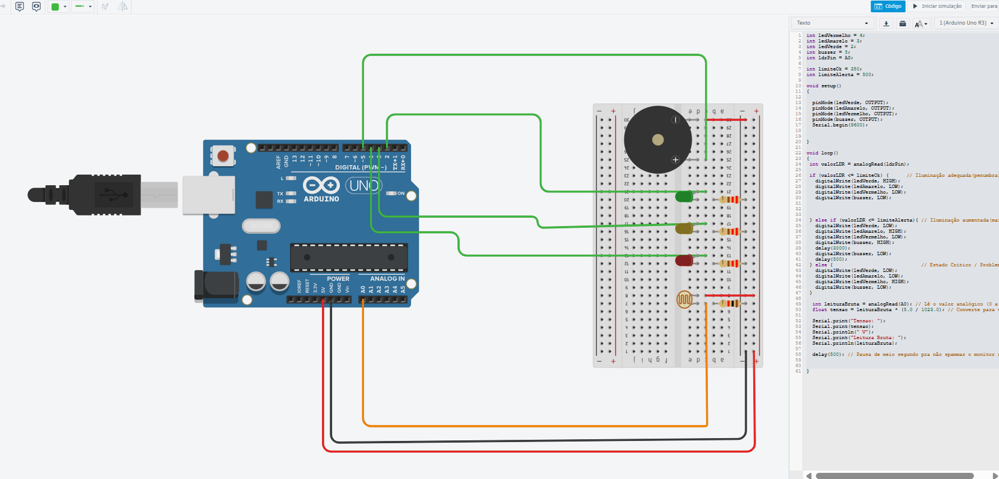

# 🍷 Projeto de Monitoramento de Luminosidade – Vinheria Agnello

Este projeto foi desenvolvido como parte do **Checkpoint 1 da disciplina de Edge Computing**, no curso de Engenharia de Software da FIAP. O objetivo é simular um sistema inteligente de monitoramento de luminosidade para vinhos armazenados, usando Arduino e sensor LDR, com alertas visuais e sonoros.

## 🧠 Objetivo

Monitorar a luminosidade do ambiente onde os vinhos são armazenados, acionando LEDs e buzzer conforme a intensidade da luz. Isso visa garantir que o vinho esteja protegido contra exposição excessiva à luz, o que pode comprometer sua qualidade.

## ⚙️ Tecnologias e componentes utilizados

- [x] Arduino Uno
- [x] LDR (Sensor de luminosidade)
- [x] Resistores de 220Ω para os LEDs
- [x] Resistor fixo de 1kΩ (divisor de tensão com LDR)
- [x] 3 LEDs (Verde, Amarelo e Vermelho)
- [x] Buzzer Piezo
- [x] Protoboard
- [x] Jumpers
- [x] Simulação via [Tinkercad](https://www.tinkercad.com/)

## 📦 Como reproduzir

1. O projeto foi desenvolvido e simulado na plataforma **Tinkercad**.  
   Você pode acessar a ferramenta em:  
   🔗 [https://www.tinkercad.com](https://www.tinkercad.com)

2. Monte o circuito conforme o esquema:
   - LDR ligado entre 5V e o pino A0.
   - Resistor fixo de 1kΩ entre A0 e GND.
   - LEDs nos pinos digitais 2 (vermelho), 3 (amarelo) e 4 (verde).
   - Buzzer no pino 5.
   - Resistor de 220Ω em série com cada LED.

3. Faça o upload do seguinte código:

// Declaração dos pinos conectados aos componentes
int ledVermelho = 4;
int ledAmarelo = 3;
int ledVerde = 2;
int buzzer = 5;
int ldrPin = A0; // Pino analógico conectado ao LDR

// Limiares de luminosidade (valores baseados na calibração experimental)
int limiteOk = 350;       // Até esse valor, a luz é considerada adequada
int limiteAlerta = 500;   // De 351 a 500, entra em nível de alerta (excesso de luz)

void setup()
{
  // Define os pinos dos LEDs e do buzzer como saída
  pinMode(ledVerde, OUTPUT);
  pinMode(ledAmarelo, OUTPUT);
  pinMode(ledVermelho, OUTPUT);
  pinMode(buzzer, OUTPUT);

  // Inicia o monitor serial para depuração
  Serial.begin(9600);
}

void loop()
{
  // Lê o valor analógico do LDR (0 a 1023)
  int valorLDR = analogRead(ldrPin);

  // Se a luz estiver adequada (penumbra ou sombra leve)
  if (valorLDR <= limiteOk) {
    digitalWrite(ledVerde, HIGH);    // LED verde acende
    digitalWrite(ledAmarelo, LOW);   // LEDs de alerta e crítico desligam
    digitalWrite(ledVermelho, LOW);
    digitalWrite(buzzer, LOW);       // Sem alarme
  }

  // Se a luz estiver forte (alerta)
  else if (valorLDR <= limiteAlerta) {
    digitalWrite(ledVerde, LOW);
    digitalWrite(ledAmarelo, HIGH);  // LED amarelo acende
    digitalWrite(ledVermelho, LOW);
    digitalWrite(buzzer, HIGH);      // Buzzer soa
    delay(3000);                     // Buzzer ativo por 3 segundos
    digitalWrite(buzzer, LOW);       // Desliga o buzzer
    delay(500);                      // Curta pausa para estabilidade
  }

  // Se a luz estiver excessiva (situação crítica)
  else {
    digitalWrite(ledVerde, LOW);
    digitalWrite(ledAmarelo, LOW);
    digitalWrite(ledVermelho, HIGH); // LED vermelho acende
    digitalWrite(buzzer, LOW);       // Buzzer permanece desligado
  }

  // Leitura extra para o monitor serial
  int leituraBruta = analogRead(A0); // Lê a tensão bruta novamente
  float tensao = leituraBruta * (5.0 / 1023.0); // Converte para volts

  // Imprime os dados no monitor serial
  Serial.print("Tensao: ");
  Serial.print(tensao);
  Serial.println(" V");

  Serial.print("Leitura Bruta: ");
  Serial.println(leituraBruta);

  delay(500); // Pequeno delay para evitar excesso de leitura
}

## 👥 Integrantes

- Matheus da Costa Barroso RM:561308
- Mayke Costa Santos RM: 562680
- Larissa Shiba Felix RM: 560462
- Felipe Kolarevic Santos RM: 565230
- GABRIEL HENRIQUE BORGES HOMBRIS RM: 566553

## 🖼️ Esquema do circuito

## 🎥 Demonstração em vídeo

[Assista ao vídeo do projeto no YouTube](https://www.youtube.com/watch?v=XBT8h-1-voI)